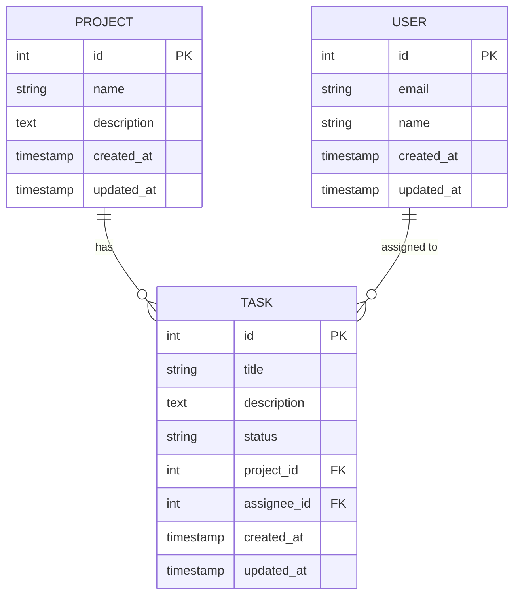

# GraphQL Demo

Quickstart:

Start the application:

```bash
docker compose up && ./gradlew bootRun
```

Navigate to
> http://localhost:8080/graphiql

## Database Schema


```mermaid
erDiagram
    USER {
        int id PK
        string email
        string name
        timestamp created_at
        timestamp updated_at
    }

    PROJECT {
        int id PK
        string name
        text description
        timestamp created_at
        timestamp updated_at
    }

    TASK {
        int id PK
        string title
        text description
        string status
        int project_id FK
        int assignee_id FK
        timestamp created_at
        timestamp updated_at
    }

    PROJECT ||--o{ TASK : "has"
    USER ||--o{ TASK : "assigned to"

```
