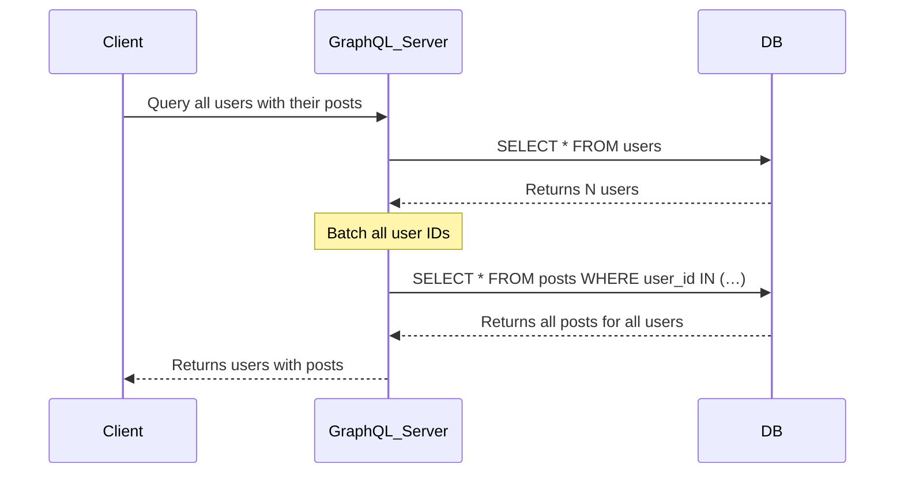

# The N+1 problem: Dataloader to the rescue 🦸‍♂️

```mermaid
sequenceDiagram
    participant Client
    participant GraphQL_Server
    participant DB

    Client->>GraphQL_Server: Query all users with their posts
    GraphQL_Server->>DB: SELECT * FROM users
    DB-->>GraphQL_Server: Returns N users

    Note over GraphQL_Server: Batch all user IDs
    GraphQL_Server->>DB: SELECT * FROM posts WHERE user_id IN (…)
    DB-->>GraphQL_Server: Returns all posts for all users

    GraphQL_Server-->>Client: Returns users with posts
```