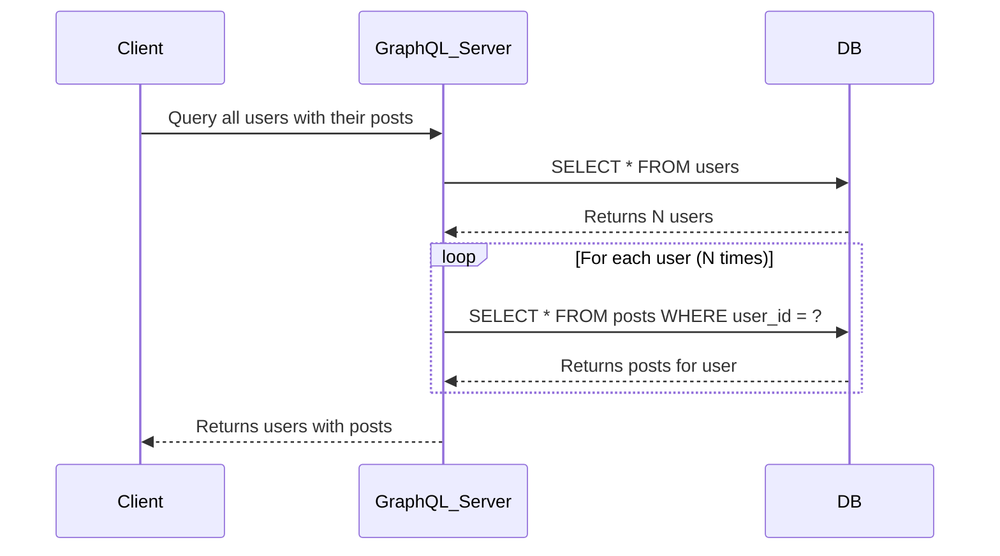

# The N+1 problem

```mermaid
sequenceDiagram
    participant Client
    participant GraphQL_Server
    participant DB

    Client->>GraphQL_Server: Query all users with their posts
    GraphQL_Server->>DB: SELECT * FROM users
    DB-->>GraphQL_Server: Returns N users

    loop For each user (N times)
        GraphQL_Server->>DB: SELECT * FROM posts WHERE user_id = ?
        DB-->>GraphQL_Server: Returns posts for user
    end

    GraphQL_Server-->>Client: Returns users with posts
```